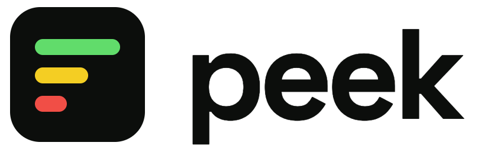
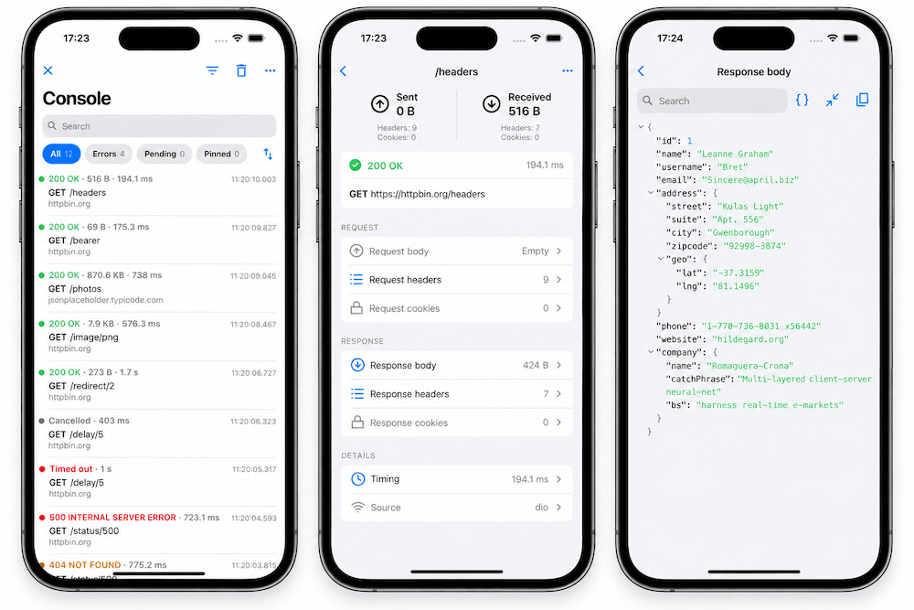

<p align="center">
  <picture>
    <source
      media="(prefers-color-scheme: dark)"
      srcset="assets/peek-logo-dark.png">
    
  </picture>
</p>

<p align="center">
  <em>A beautiful in-app network inspector for Flutter: every call your app makes, as it happened.</em>
</p>

<p align="center">
  <a href="https://pub.dev/packages/peek"></a>
  <a href="https://github.com/artdima/peek/actions/workflows/ci.yml"></a>
  <a href="https://codecov.io/gh/artdima/peek"></a>
  <a href="https://github.com/artdima/peek/blob/main/LICENSE"></a>
</p>

---

**What Peek is.** A network inspector that lives inside the app. An adapter
sits beside the client you already build — Dio, Chopper, `package:http` — and
reports every call it makes; with Talker, where the calls are logged already,
it reads them instead of recording them twice. What arrives is a console you
open on the device: searchable, filterable, one call at a time down to the
last header, with export as cURL, HAR, Markdown or text.

**What Peek is not.** A participant in the request, or a second console
logger. Peek does not create a client, does not wrap `Dio`, does not touch
`HttpOverrides` and does not print a line anywhere — keep the console logger
you like. A call goes out as the app built it and comes back as it arrived:
nothing is delayed, retried, rewritten or dropped along the way, and
`package:http`, the one client with nowhere to watch from, is wrapped only to
pass every byte straight through. An adapter is a pair of eyes, not a pair of
hands — and if anything inside Peek fails, the failure reaches
`PeekOptions.onError`, never your app.

**Inspired by Pulse.** Peek is inspired by
[Pulse](https://github.com/kean/Pulse), the network logger for Apple
platforms. It is an independent project, written from scratch for Flutter.

<p align="center">
  
</p>

## Quick start

With Dio, two lines where the client is built and one wherever you want a
button:

```dart
final dio = Dio(BaseOptions(baseUrl: 'https://api.example.com'));
dio.interceptors.add(PeekDioInterceptor(Peek.instance));

// Later, from any widget:
showPeek(context);
```

With Talker, one line next to the Talker you already have — the calls its
loggers see are Peek's:

```dart
final peek = Peek();
peek.attach(PeekTalkerAdapter(peek, talker: talker));
dio.interceptors.add(TalkerDioLogger(talker: talker));

showPeek(context, peek: peek);
```

With Chopper, one interceptor in the chain:

```dart
final client = ChopperClient(
  baseUrl: Uri.parse('https://api.example.com'),
  interceptors: [PeekChopperInterceptor(Peek.instance)],
);

showPeek(context);
```

With `package:http`, which has no interceptors, one client around the one you
have:

```dart
final client = PeekHttpClient(Peek.instance, http.Client());

showPeek(context);
```

Prefer a floating button that is always there? Wrap the app once:

```dart
MaterialApp(
  builder: (context, child) => PeekOverlay(
    enabled: kDebugMode,
    child: child!,
  ),
);
```

These lines are compiled, not just quoted: they live in
[`packages/peek/example`](packages/peek/example), an app that makes real
calls all four ways and drives every screen.

## Packages

| Package | What it is | Depends on |
| --- | --- | --- |
| [`peek`](packages/peek) | The core model, store and exporters (`package:peek/core.dart`, pure Dart) and the Flutter UI (`package:peek/peek.dart`) | `flutter`, `meta` |
| [`peek_chopper`](packages/peek_chopper) | `PeekChopperInterceptor`: reports what a Chopper client does | `peek`, `chopper`, `http` |
| [`peek_dio`](packages/peek_dio) | `PeekDioInterceptor`: reports what a Dio client does | `peek`, `dio` |
| [`peek_http`](packages/peek_http) | `PeekHttpClient`: reports what a `package:http` client does | `peek`, `http` |
| [`peek_talker`](packages/peek_talker) | `PeekTalkerAdapter`: reads what Talker logs, `talker_dio_logger` understood out of the box | `peek`, `peek_dio`, `talker`, `talker_dio_logger` |

## Configuration

Everything is set once, on the `Peek` instance, and applies to every
adapter:

```dart
final peek = Peek(
  options: PeekOptions(
    enabled: kDebugMode,
    limits: const PeekLimits(maxEntries: 500, maxBodyBytes: 256 * 1024),
    redaction: PeekRedactionPolicy(
      headerNames: {...PeekRedactionPolicy.defaultHeaderNames, 'x-session'},
    ),
    onError: (error, stackTrace) => log('peek: $error'),
  ),
);
```

- **`enabled`** — pass `kDebugMode` to switch Peek off in release builds
  without touching the adapters.
- **`limits`** — how many calls are kept, how many bytes of a body, how
  many calls may be pinned. What a body limit costs is `maxEntries` of
  them, so raise one with the other in mind.
- **`redaction`** — nothing is masked until asked. `PeekRedactionPolicy()`
  covers the usual names (`Authorization`, `Cookie`, `token`, `password`
  and their relatives); each set replaces the built-in one, so extend a set
  by spreading the defaults back in.
- **Theme** — Peek brings its own look and takes only the brightness from
  the app. Register an override on the app's theme to change any token:
  `ThemeData(extensions: [PeekTheme.light().copyWith(accent: Colors.teal)])`.
- **Strings** — subclass `PeekStrings`, override what you translate, and
  pass it to `showPeek(context, strings: ...)`.
- **Sharing** — Peek depends on no sharing package. Hand it a
  `PeekShareDelegate` wired to the one you use; the example shows it with
  `share_plus`. On the web there is nothing to hand over: the browser
  saves the file, and a delegate given there is still used instead.

## Writing your own adapter

An adapter watches a logger and reports `PeekEvent`s into a `PeekSink`. It
needs one import — `package:peek/core.dart` — and about a screen of code;
[`doc/adapters.md`](doc/adapters.md) is the guide, from the contract to the
package layout, with a checklist at the end.

## Contributing

Bugs and ideas go through the issue templates; pull requests through
[`CONTRIBUTING.md`](CONTRIBUTING.md), which has the setup, the scripts and
the definition of done. Security reports are private: see
[`SECURITY.md`](SECURITY.md).

## License

MIT © 2026 Dmitrii Medyannik. The icon outlines come from
[Lucide](https://lucide.dev) (ISC); see [`NOTICE`](NOTICE).
